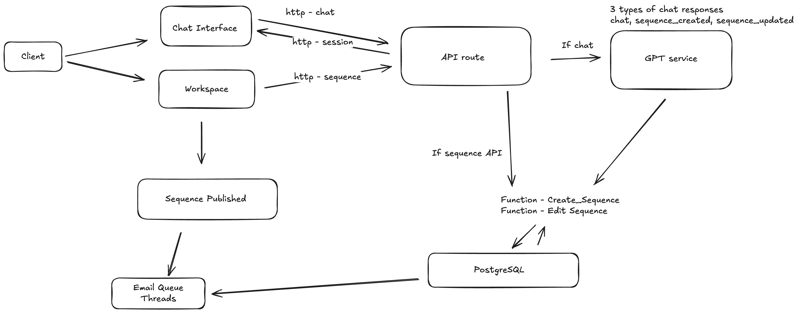

# SellScale

This project consists of a Next.js frontend and a Flask backend, designed to work together seamlessly. Below are the setup instructions for both components.





## Prerequisites

- Node.js (v18 or higher)
- Python (v3.9 or higher)
- npm or yarn
- pip
- Supabase account (for database)

## Frontend Setup

The frontend is built with Next.js, React, and Tailwind CSS.

1. Navigate to the frontend directory:
   ```bash
   cd frontend
   ```

2. Install dependencies:
   ```bash
   npm install
   # or
   yarn install
   ```

3. Start the development server:
   ```bash
   npm run dev
   # or
   yarn dev
   ```

The frontend will be available at `http://localhost:3000`

## Backend Setup

The backend is built with Flask and uses Supabase for database operations.

1. Navigate to the backend directory:
   ```bash
   cd backend
   ```

2. Create and activate a virtual environment:
   ```bash
   python -m venv venv
   source venv/bin/activate  # On Windows, use: venv\Scripts\activate
   ```

3. Install dependencies:
   ```bash
   pip install -r requirements.txt
   ```

4. Create a `.env` file in the backend directory with the following variables:
   ```
   FLASK_APP=run.py
   FLASK_ENV=development
   SUPABASE_URL=your_supabase_url
   SUPABASE_KEY=your_supabase_key
   OPENAI_API_KEY=your_openai_api_key
   
    SMTP_HOST=host
    SMTP_PORT=port
    SMTP_USERNAME=username
    SMTP_PASSWORD=password
    SMTP_FROM_NAME=recruiter
    SMTP_USE_SSL=false
   ```

5. Initialize the database:
   ```bash
   # Run the Supabase schema
   psql -U your_username -d your_database -f supabase_schema.sql
   ```

6. Start the backend server:
   ```bash
   python3 run.py
   ```

The backend API will be available at `http://localhost:5001`

## Project Structure

- `frontend/`: Next.js frontend application
  - `app/`: Next.js app directory
  - `components/`: Reusable React components
  - `lib/`: Utility functions and configurations
  - `public/`: Static assets
  - `types/`: TypeScript type definitions
  - `components.json`: Shadcn UI configuration

- `backend/`: Flask backend application
  - `app/`: Main application code
  - `supabase_schema.sql`: Database schema

## Development

- Frontend development server runs on port 3000
- Backend API server runs on port 5001

## Testing


## Contributing

1. Create a new branch for your feature
2. Make your changes
3. Run tests
4. Submit a pull request

## Contact

nanawarepranav@gmail.com
